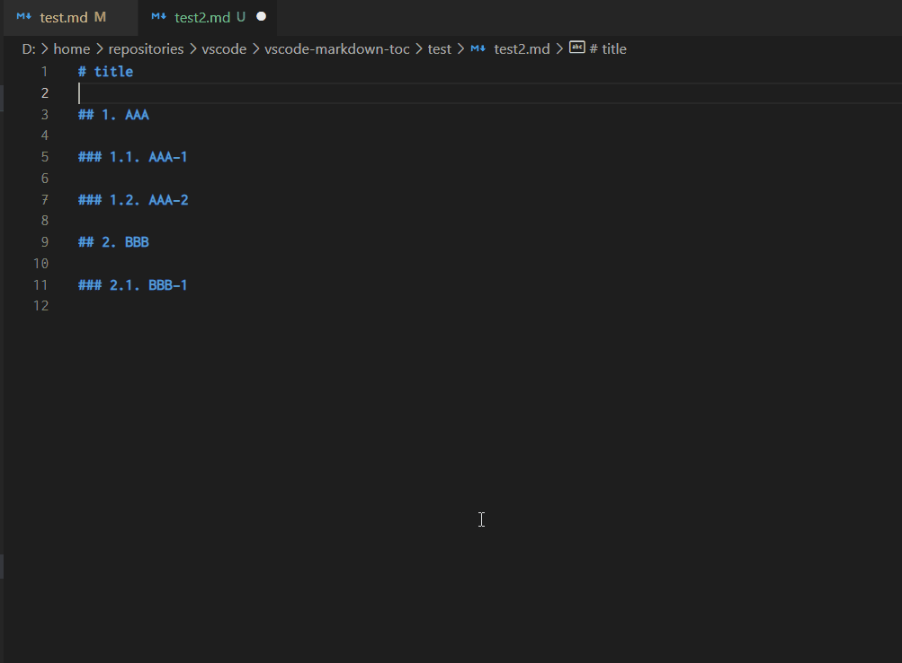

# Markdown TOC & Chapter Number

Add commands for table of contents (TOC) and chapter numbering to markdown.

## Features

- Add command to generate a table of contents (TOC)
- Add command to add chapter numbers
- Control each depth independently
- Insert anchor in TOC

## Demo



### Configuration

| Configuration ID              | Description                                 | Type   | Default |
| ----------------------------- | ------------------------------------------- | ------ | ------- |
| markdown-toc.tocDepthFrom     | TOC depth control, from [1-6]               | number | 2       |
| markdown-toc.tocDepthTo       | TOC depth control, to [1-6]                 | number | 3       |
| markdown-toc.chapterDepthFrom | Chapter numbering depth control, from [1-6] | number | 1       |
| markdown-toc.chapterDepthTo   | Chapter numbering depth control, to [1-6]   | number | 6       |
| markdown-toc.anchorMode       | Anchor style [vscode, gitlab, none]         | string | vscode  |

You can override them inline.

```md
<!-- TOC tocDepthFrom:1 tocDepthTo:6 -->

<!-- TOC tocDepth:1..6 -->

<!-- TOC chapterDepthFrom:2 chapterDepthTo:6 -->

<!-- TOC chapterDepth:2..6 -->
```

### Omit chapter in TOC

In case you are seeing unexpected TOC recognition, you can add a <!-- omit in toc --> comment above the list.

## Release Notes

- See [changelog](CHANGELOG.md).

## Links

- [Source Code](https://github.com/takumisoft68/vscode-markdown-toc)
- [Marketplace](https://marketplace.visualstudio.com/items?itemName=TakumiI.markdown-toc)

## License

Apache 2.0, See [LICENSE](LICENSE) for more information.
